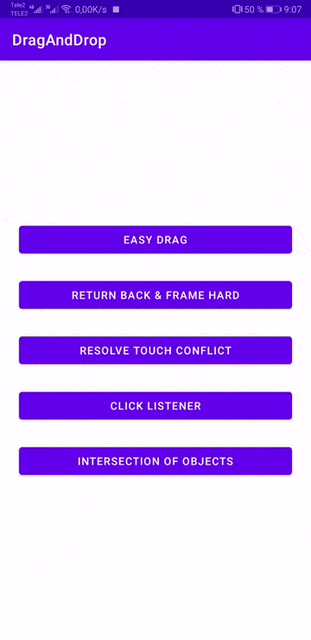
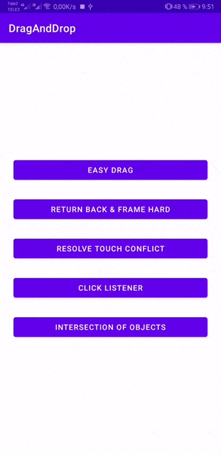

# DragAndDrop 
Easy to use drag and drop for android
# Preview
1\. Eassy drag



2\. Return back & Frame hard


3\. Resolve touch conflict


4\. Click listener


5\. Intersection of objects



# To get a Git project into your build:

```
dependencies {
	        implementation 'io.github.a.lab.develop:draganddrop:1.0.5'
	}
```
